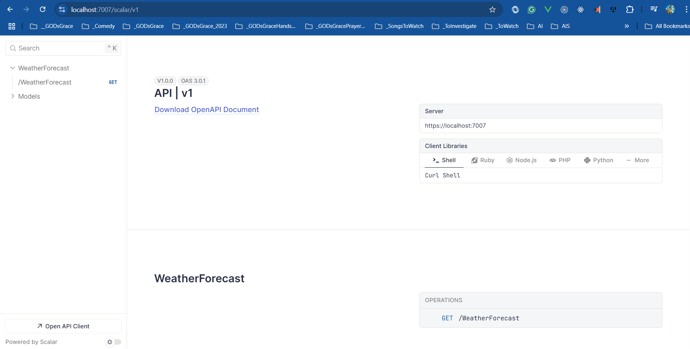

# Dating Application

👥 **DatingApp** – Full Stack Web Application with .NET 9 & Angular 20

This repository contains a production-grade full-stack application developed while following Neil Cummings' course on modern web development. It features a robust .NET 9 backend API integrated with an Angular 20 frontend, leveraging Entity Framework Core for seamless data access and persistence.

## 🔧 Tech Stack Overview

> 1. Backend: ASP.NET Core 9 Web API
> 1. Frontend: Angular 20 SPA
> 1. Database: EF Core + SQL Server
> 1. Authentication: JWT-based Auth
> 1. Real-Time Communication: SignalR
> 1. UI Components: Angular Material

🚀 The project emphasizes clean architecture, secure authentication, rich user profiles, and scalable design patterns—ideal for full-stack developers aiming to sharpen practical skills.

🔗 Inspired by [Neil Cummings' DatingApp course and source code](https://github.com/TryCatchLearn/DatingApp)

## Prerequisites

- .NET 9.0 SDK
- Node.js 18+ (for Angular frontend)
- SQL Server or SQLite
- Visual Studio 2022 or VS Code

## Getting Started

1. Clone the repository
2. Navigate to the project directory
3. Restore dependencies: `dotnet restore`
4. Run the API: `dotnet run --project src/API`
5. Open browser to: `https://localhost:7007/scalar/v1`

## Project Setup Instructions

```powershell
# Check .NET version
dotnet --info

# List available templates
dotnet new list

# Create solution
dotnet sln -h
dotnet new sln

# Create API project with controllers
dotnet new webapi -controllers -n API -f net9.0 -o src/API
dotnet sln add src/API/

# List solution projects
dotnet sln list

# Restore packages
dotnet restore

# Run the application
dotnet run --project src/API
```

## Project Structure

```text
├── src/
│   ├── API/              # ASP.NET Core Web API
│   └── Client/           # Angular frontend (coming soon)
├── docs/                 # Documentation and images
│   └── images/           # Screenshots and diagrams
├── tests/               # Unit and integration tests
├── Directory.Build.props # Common build properties
├── Directory.Packages.props # Centralized package management
└── datingapp-course.sln # Solution file
```

## Features

- [ ] User Authentication & Authorization
- [ ] User Profiles & Photo Upload
- [ ] Real-time Messaging (SignalR)
- [ ] Matching Algorithm
- [ ] Like/Unlike Functionality
- [ ] Private Messaging
- [ ] Admin Panel
- [x] OpenAPI Documentation
- [x] Scalar API Explorer

## API Endpoints

> 1. [Open API](https://localhost:7007/openapi/v1.json)
> 1. [Scalar](https://localhost:7007/scalar/v1)



## Development

### Running the API

```powershell
# Navigate to API project
cd src/API

# Run in development mode
dotnet run

# Or run with hot reload
dotnet watch run
```

The API will be available at:

- HTTPS: `https://localhost:7007`
- HTTP: `http://localhost:5228`

### API Documentation

- **OpenAPI Specification**: `/openapi/v1.json`
- **Scalar API Explorer**: `/scalar/v1` (Development only)

## Contributing

1. Fork the repository
2. Create a feature branch (`git checkout -b feature/amazing-feature`)
3. Commit your changes (`git commit -m 'Add some amazing feature'`)
4. Push to the branch (`git push origin feature/amazing-feature`)
5. Open a Pull Request

## License

This project is licensed under the MIT License - see the [LICENSE](LICENSE) file for details.

## Acknowledgments

- [Neil Cummings](https://github.com/TryCatchLearn) for the excellent course and guidance
- The .NET and Angular communities for their amazing tools and frameworks
